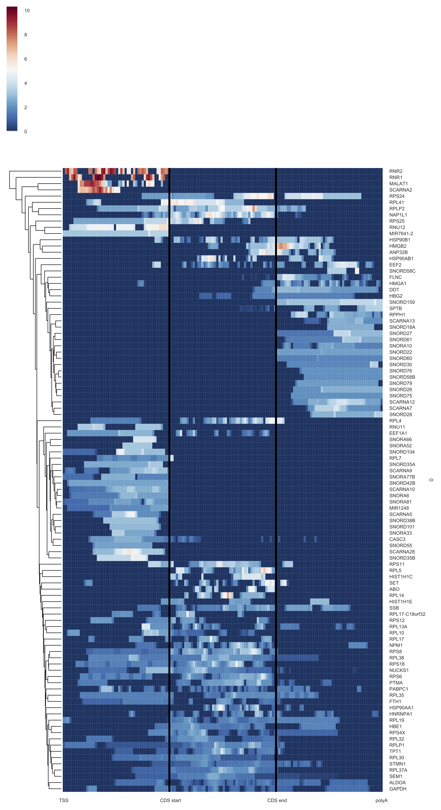
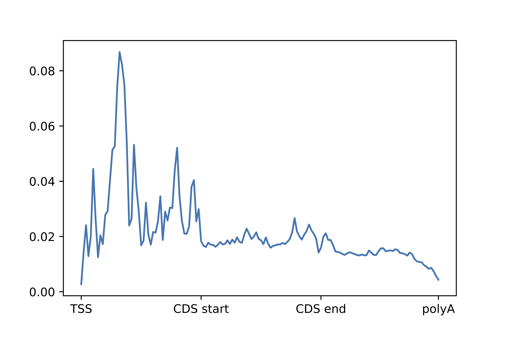
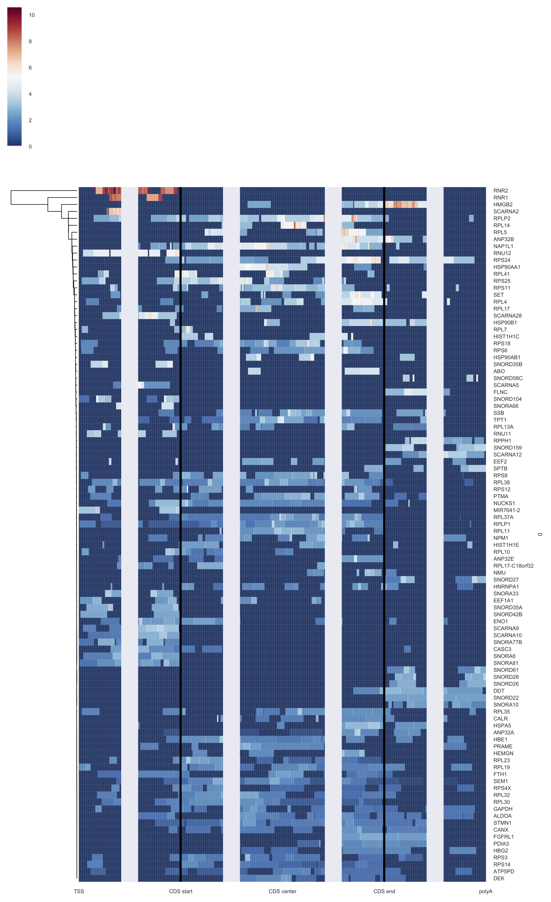
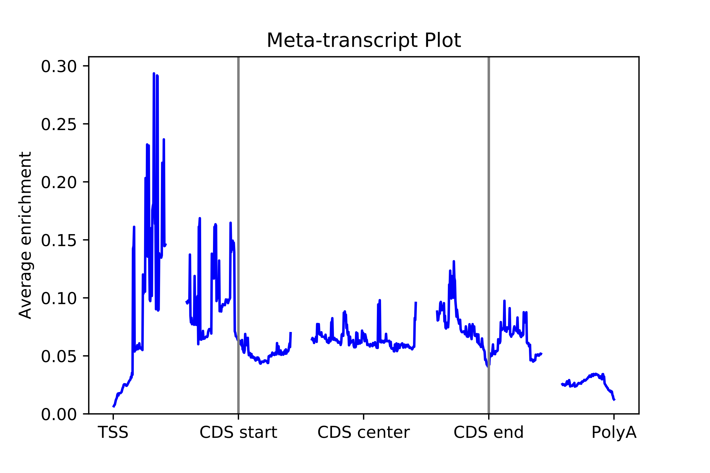

# Examples
All sample datasets can be downloaded from the [Downloads](Downloads.md) page.
## Sample input

There are three required inputs for MFAS: the feature file, the annotation file and the ID file.

### 1. Feature file: example_features.bed

Feature file is required in bed6 format. An eCLIP-seq sample input is as below:

The columns are: chromosome, start, end, ID, score, and strand. The fourth column can be filled with any character as a place holder if there's no specific IDs. The fifth column shows the score of the feature, and we call it as 'bed-like' score when it stands for the total read counts in that region and 'bedgraph-like' score when it stands for the read coverage of every position within that region. The sixth column should be the strand information.

### 2.Annotation file: example_annotation.bed

Annotation file is required in bed12 format. A Refseq annotation sample input is as below:

This example is a standard format of bed12 file for transcripts' annotations in hg19.

### 3. ID file: example_ID.txt

ID file is required in plain text format with two columns. A Refseq annotation sample input is as below:

The first column of this ID file should be the same as the 4th column of the annotation file.

## Sample commands and output

There are 6 groups of meta-feature analysis (defined by option -w) 1 -- Meta-transcript, 2 -- Meta-exon, 3 -- Meta-intron, 4 -- Meta-con_introns, 5 -- Meta-gene, 6 -- Meta customized region.
For each group of analysis, there are two classes of coordinate system (defined by option -x) 1 -- norm, 2 -- abs.
For any kind of meta-feature analysis, there are two types of analysis can be applied (defined by option -a) 1 -- sense strand or 2 -- anti-sense strand.
Therefore, MFAS provides 24 types of meta-feature analysis given customized inputs. Here, we give two examples of the usage.

### 1. Sense-strand Meta-transcript analysis on the normalized length scale.

Command:
    python MFAS.py -b sample_annotation.bed -i sample_feature.bed -t sample_ID.txt -w 1 -x norm -n 50 -f bedlike -a 0 -p 1 -s 100

This line of command performs the meta-transcript analysis (-w 1) on the normalized length scale (-x norm). It uses 50 bins (-n 50) to normalize 5'UTR, CDS and 3'UTR and align all the transcript together by four reference sites: transcription start site, CDS start site, CDS end site, and polyA site. The iput bed6 file is bedlike file (-f bedlike) and no anti-sense analysis is performed but showing the visualization (-p 1) of top 100 transcripts (-s 100) in heatmap.

Output files:
#### (a) example_features_trans.txt

This is base-level feature for all the transcripts.

There are five columns of this output file. They are transcript ID, gene ID, CDS start site and CDS end site on the transcript coordinate, as well as the feature profile in single-nucleotide resolution separated by comma.

#### (b) example_features_trans_meta_150_bins.txt

This is the averaged meta-feature file with 150 bins in total across all transcripts.

This is a single-column file with 150 rows, which shows the final meta-feature of the dataset.

#### (c) example_features_trans_meta_150_bins_individual.txt

This is the features in 150 bins for individual transcript.

#### (d) example_features_trans_150_bins_individual_heatmap.pdf

This is the heatmap for top 100 transcripts ranked by the sum of score.

#### (e) example_features_trans_150_bins.pdf

This is the line chart for all transcripts.

### 2. Sense-strand Meta-transcript analysis on the absolute length scale.

Command:
    python MFAS.py -b sample_annotation.bed -i sample_feature.bed -t sample_ID.txt -w 1 -x abs -d 100,100,100,100,100,100,100,100 -f bedlike -a 0 -p 1 -s 100

This line of command performs the meta-transcript analysis (-w 1) on the absolute length scale (-x abs). It uses 100 bps as the largest distance included: downstream to the TSS, upstrem to the CDS start, downstream to the CDS start, upstrem to the CDS center, downstream to the CDS center, upstream to the CDS end, downstream to the CDS end, and upstream to the polyA site.  Interested regions defined by the distance list are aligned together across all the transcript together. The iput bed6 file is bedlike file (-f bedlike) and no anti-sense analysis is performed but showing the visualization (-p 1) of top 100 transcripts (-s 100) in heatmap.

Output files:
#### (a) example_features_trans.txt
This file is extactly same as that of the First example above.

#### (b) example_features_trans_meta_100_100_100_100_100_100_100_100_bps.txt
This is the averaged meta-feature file across all transcripts.

#### (c) example_features_trans_100_100_100_100_100_100_100_100_bps_individual.txt
This is the individual feature in defined coordinate ranges for all transcripts.

#### (d) example_features_trans_100_100_100_100_100_100_100_100_bps_individual_heatmap.pdf

This is the heatmap for top 100 transcripts ranked by the sum of score.

#### (e) example_features_trans_meta_100_100_100_100_100_100_100_100_bps_line.pdf

This is the line chart for all transcripts.

