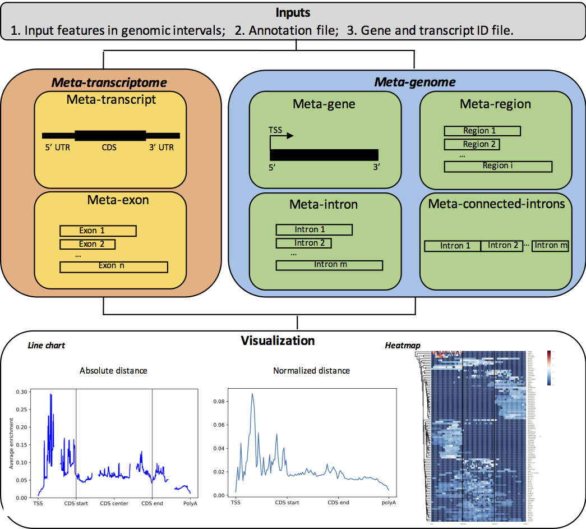

# MFAS
Meta-Feature Analysis System (MFAS), a comprehensive and efficient toolkit to handle more than 20 types of meta-feature analysis in both genome and transcriptome. It provides the option to output the meta-feature table or the visualization plots.

## [Instructions](Instructions.md)
1. Prerequisites
2. Run MFAS

## [Downloads](Downloads.md)
1. Source code
2. Sample data
3. ENCODE eCLIP metagene profiles

## [Examples](Examples.md)
1. Sample input
3. Sample output

## Reference
[Lin, J., Chen, Y., Zhang, Y., Haifan L., & Ouyang, Z. (20xx). Deciphering the role of RNA structure in RNA translation]()

## License
Use of MFAS is free for academic users under the GNU General Public License (GPL). Commercial users please contact the authors.

## Contact
Zhengqing Ouyang: ouyang@schoolph.umass.edu
Jianan Lin: jianan.jay.lin@gmail.com
